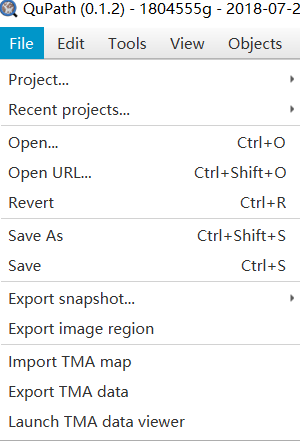
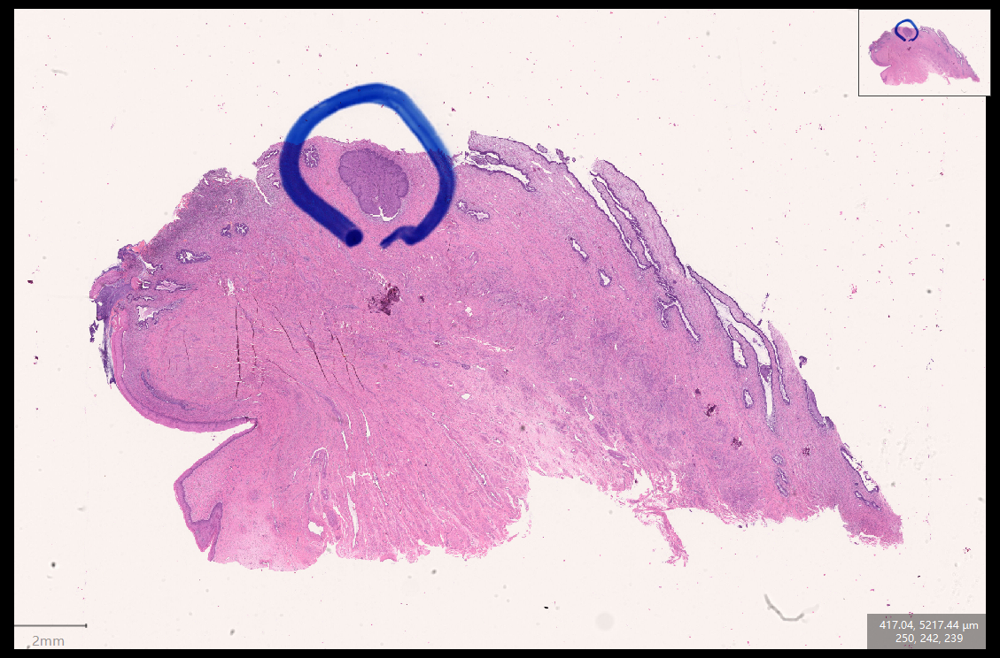
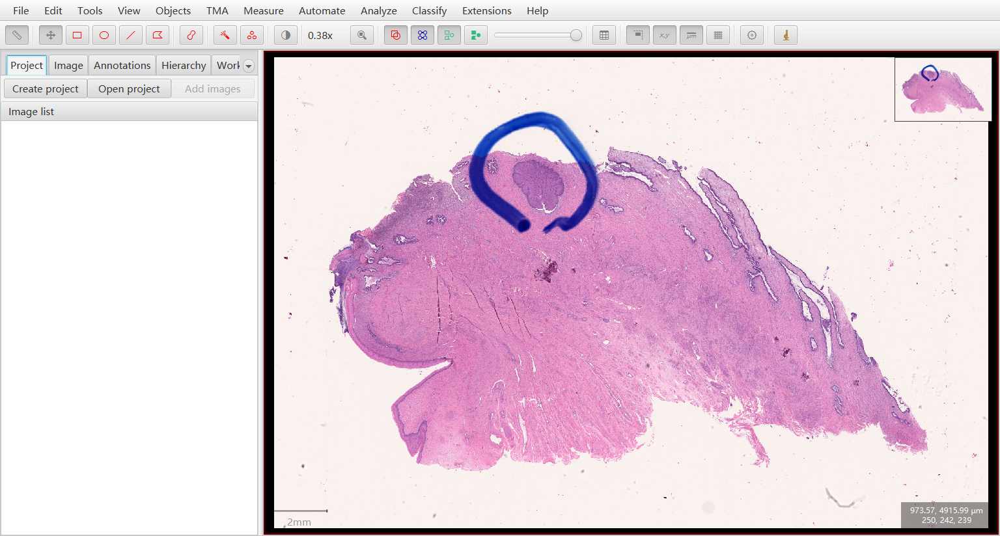
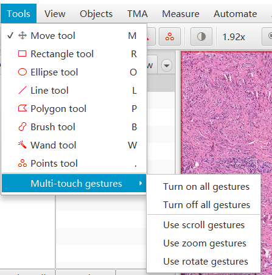
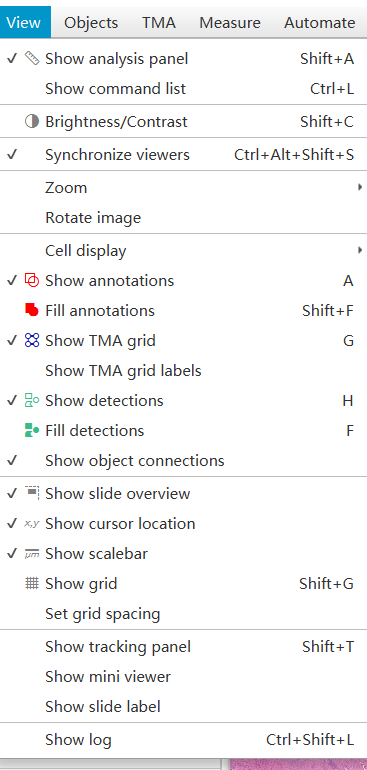
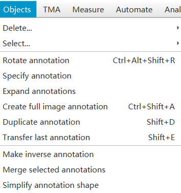
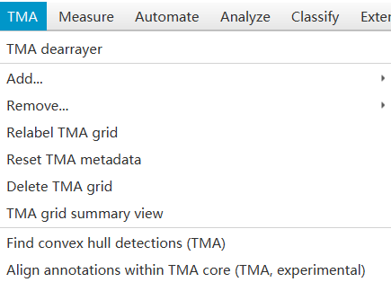
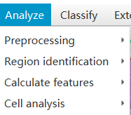
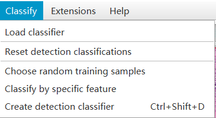
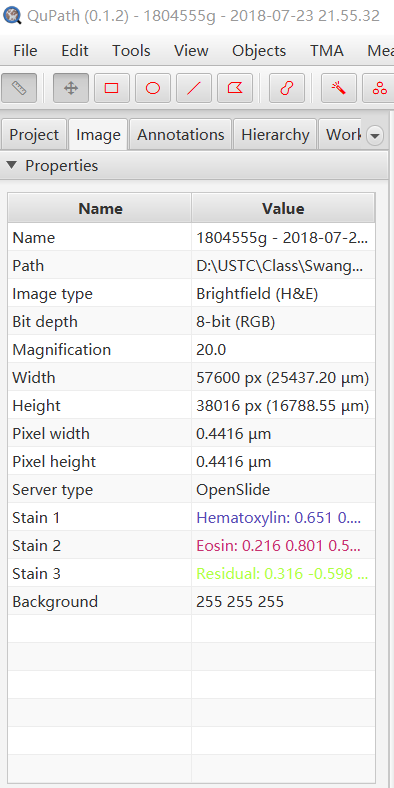

# QuPath Analyze
##### edited by William on 28 Sep 2018·1 revisions
---
此篇文章主要用于简要分析开源病理图像处理软件QuPath

分析顺序依照其菜单栏的从左至右顺序

---

## *File*

- **Project / Recent Project**

  打开项目，一个项目中可以添加多张图片

- **Open / Open URL / Revert**

  根据文件在机器上的存储路径，URL以及历史纪录打开病理图像

- **Save As / Save**

  在选中目录/当前目录存储当前处理过的病理图像

- **Export snapshot**

  在选中目录存储截图文件，可选择仅截取病理图像区域或截取软件框区域

  仅截取病理图像区域： 

  仅截取软件区域： 

- **import TMA map / Export TMA data / Launch TMA data viewer**

  载入载出TMA图像，启动TMA图像编辑器

---

## *Tools*

由于Tools内的功能是常用功能，因此其所有内容可在菜单栏下一行找到。

Tools主要用于对病理图像进行标注，其中标注方法包括矩形，椭圆形，线形，多边形，毛刷涂抹，魔术棒，标点标注。

前几种较为普遍，在此不做过多描述，主要对Wand tool以及Points tool进行描述。

- **Wand tool**

  魔术棒标注主要是由软件自由扩展至周围与标记块的像素值相差不大的区域。 
  
  若是病灶区域与周围的明暗度相差较大，则可以用此方法以较高精度快速标注病灶区域；
  
  此方法也可以用于标注细胞密集区。

- **Points tool**

  标点标注主要用于对某一区域内的各类细胞的数目进行统计。
 
  需要使用者对某一区域缩放至合适大小后，对各类细胞进行标记。

  标记后可以对细胞数进行统计，以及对标记文件进行导入导出操作。

---

## *View*

View菜单控制整个软件的视图效果,本文仅在其中选择几个较为重要的选项进行解释

- **Show analysis panel**

  控制是否显示菜单栏下一栏常用分析操作栏

- **Synchronize viewers**

  在图像显示区域可以网格的形式显示多张图片，该操作用于控制是否同步各个网格中的操作

- **Cell display**

  控制识别细胞后显示的区域，共有三种选项，分别为仅显示细胞膜，仅显示细胞核，显示细胞膜与细胞核。

- **Show annotations / TMA grid / detections**

  控制是否显示标注后的标注框，TMA 网格，细胞检测后的检测图像。

- **Show slide overview / cursor location / scalebar / grid**

  控制是否在图像区域全局图，光标坐标，比例尺，网格。

  此四种操作在常用分析操作栏中可以找到。

- **Show tracking panel / mini viewer / slide label**

  打开图像区域的录制工具，打开光标所在区域的放大镜视图，？？

---

## *Objects*

此栏用于对标注后的标注框 (annotation) 进行操作

- **Rotate / Specify / Expand annotation**

  旋转选中标注框；创建特定属性标注框；对选中标注框进行扩展，并形成新的标注框。

- **Create full image annotation / Duplicate annotation / Transfer last annotation**

  创建大小为整个图片的标注框；在选中框原位置复制选中的标注框； ？？

- **Make inverse annotation / Merge selected annotations / Simplify annotation shape**

  
  ？？ ；将选中的多个标注框合并为一个标注框；将选中的标注框的边缘简化

---

## *TMA* 

TMA为Tissue MicroArrays的缩写，为一个阵列的切片图像。

- **TMA dearrayer**

  在加载一个TMA图像后，需使用TMA dearrayer来识别TMA核的位置 

- **Add / Remove**

  此功能可用于添加或删除一行或一列的TMA列

- **Relabel TMA grid / Reset TMA metadata / Delete TMA grid**

  将TMA网格重新标号；重置TMA数据；删除TMA网格

- **Find convex hull detections**

  Unknown

---

## *Analyze* 

此栏用于对图像内容进行一些较为专业的自动化分析，其中前三项主要用于TMA数据的处理

- **Preprocessing**
  
  此选项内包括 Estimate Stain Vectors 与 Simple Tissue Detection
  
  *Estimate Stain Vectors*
    
    对病理图像内的组织内部颜色的分布进行标准化的表达，并显示图像信息与识别参数。

  *Simple Tissue Detection*

    基于阈值对病理图像内的细胞进行简单的二分类，用于对图像内的各个组织所在位置进行检测。

    多用于对TMA图像各个核心的检测。                        

- **Rigion identification**

  此栏内包括 Tiles & Superpixels , Positivepixel count , Create cytokeratin annotations

  *Tiles & Superpixels*
  
    对选中的标注框进行网格化（Tiles），或利用超像素（Superpixel）算法对标注框进行分割，便于分析细胞群。

  *Positivepixel count (正像素技术算法)*

    对选中的标注框内的图像扫描存在的特定染色的量，即由用户选择扫描染色的颜色与量，可以以较好的结果确定组织的位置与边界。

  *Creat cytokeratin annotations*

    依据细胞角质蛋白创建标注框，可用于检测癌细胞。

- **Calculate features**

  此栏内大部分功能尚在实验中

  其中Add Smoothed Features用于对已进行过细胞检测的标注框进行处理，为之后对细胞群进行分类提供Smooth参数

- **Cell analysis**

  此栏内包括 Cell Detection, Positive Cell Detection , Cell + membrane Detection 与 Fast Cell Detection

  *Cell Detection*
    
    对选中标注框内的细胞进行检测，并将其全部显示出来

  *Positive Cell Detection*

    与上相同，在识别细胞后，将其与DAB intensity的预设阈值相比较，并据此将细胞分为正例与负例

  *Cell + Menbrane Detection*

    无结果

  *Fast Cell Detection*

    此方法与以上两种相似，在处理速度上进行了优化。

---

## *Classify*

> 分类流程：使用标注框选定分类区域 -> 对标注框内区域进行细胞检测（Analyze -> Cell analysis -> Cell detection） -> 采集特征（Analyze -> Calculate Features -> Add Smoothed Features） -> 采用标注框选定不同类别的细胞样本并给其设置类（Set Class）-> 新建分类器（Classify -> Create detection classifier -> Auto-update -> Buile & Apply）

- **Load classifier**

  加载本地分类器

- **Reset detection classification**

  重置检测分类

- **Choose random training samples**

  随机选择训练样本区域

- **Create detection classifier**

  创建一个分类器

---

## *WorkSpace*

WorkSpace为图像显示区域左侧的工作区，其共有五个标签页，用于显示打开项目的信息。

- **Project**

  Project标签页用于显示项目中所打开的图片（如之前所说，单个项目中可打开多个图片）

- **Image**

  Image标签页用于显示选中的图片的各种可用于分析的信息，如图：

  

- **Annotations**

  Annotations用于描述在选中的图片中各个标注框的类别，位置，形状与标签

- **Hierarchy**

  Unknown

- **Workflow**

  Unknown

