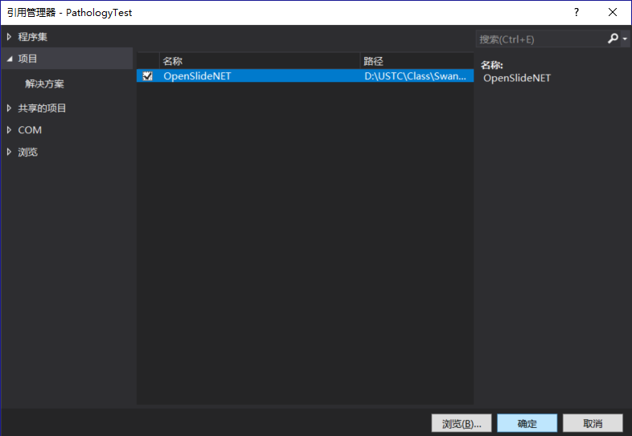
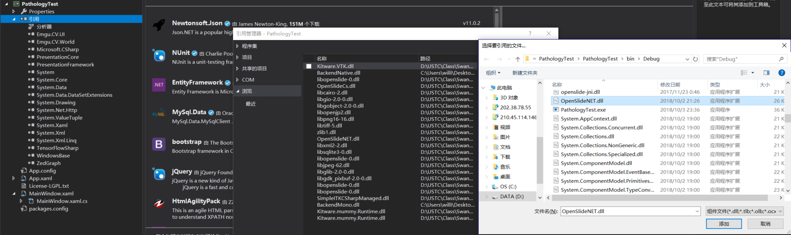

## OpenSlide for C#
---

Here is a tutorial for configuring [OpenSlideNET](https://github.com/yigolden/OpenSlideNET) in .NET enviroment.

> Tips: The version of C# compiler should be larger than 7.2 or you will not be able to build the project OpenSlideNET.

---

### 1. Install OpenSlide for windows

前往[OpenSlide官网](https://openslide.org/download/)下载OpenSlide的Windows Binaries. 选择合适的操作系统位数。


### 2. Extract needed .dll file

由于OpenSlideNET代码本身是基于OpenSlide for C,因此需要将OpenSlide for C中的libopenslide-0.dll及其依赖库手动添加至C#开发环境中。

因此需要将解压后文件夹中的bin目录下的dll全部拷贝至开发的C# .NET项目的/bin/Debug目录。

(该图片文件不全，需拷贝目录下所有dll文件)


### 3. Install OpenSlideNET

前往[OpenSlideNET仓库](https://github.com/yigolden/OpenSlideNET)下载OpenSlideNET源码并解压。

### 4. Reference OpenSlideNET 

将OpenSlideNET项目下的src -> OpenSlideNET -> OpenSlideNET.csproj 通过添加现有项目添加至正在开发的C#项目中。

并在正在开发的C#项目中添加引用 -> 项目 -> 勾选OpenSlideNET -> 点击确定添加。



### 5. Configure Targetframework

右键点击OpenSlideNET项目进入属性配置，在生成标签页内，将目标平台设置为x64或x86(与下载的安装包一致)，对开发的项目做相同的操作。


### 6. Build Project

在开发项目的引用部分输入 ```using OpenSlideNET``` ，而后即可使用。


### 7. (Extra) Shrink the Project

在运行一次过后，OpenSlideNET的dll以及它的依赖包已被加载进开发项目的/bin/Debug目录下。

因此可以在开发项目的引用中移除OpenSlideNET，并在解决方案中移除OpenSlideNET项目。

最后在开发项目中引用自身项目目录中的/bin/Debug/OpenSlideNET.dll.


